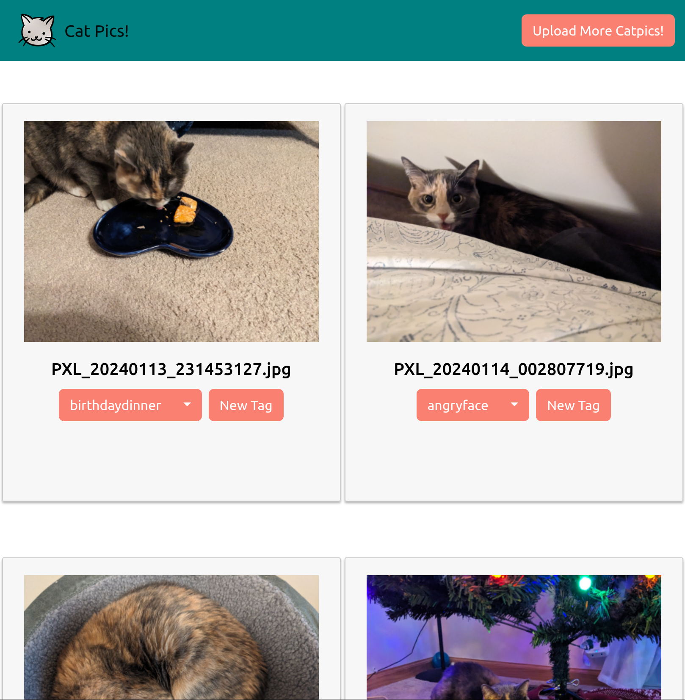

# Picture Categorizer

Picture Categorizer is public image gallery software. An instance of Picture Categorizer runs at [Catpics!](https://catpics.fun),
devoted entirely to those animals we most love, cats! To best serve our cat overlords, Picture Categorizer has gone through
several different iterations:

1. Originally developed in Kotlin + Spring Boot as a fun software engineering project for my master's.
2. Next, the server back-end was migrated to Ktor to improve resource usage as Spring Boot has pretty heavy resource requirements.
3. Then the server back-end was migrated to ExpressJS/Typescript to further improve resource usage (this surprised me as well).
4. Finally, to further reduce resource requirements and improve the portability of the application, the database was
migrated to SQLite from MySQL.



Given all of these migrations, there may be some artifacts from previous iterations that don't quite make sense in its
current form. If you see them, submit a PR to clean them up!

# Development

[](https://github.com/davidvedvick/picture-categorizer/actions/workflows/dockerbuild.yml)

## Getting Started

These instructions will get you a copy of the project up and running on your local machine for development
and testing purposes.

### Prerequisites

NodeJS 16+ is required to develop catpics. For full builds, docker is required.

### Building

To run a CI build like it is run in Github, run the following command:

```shell
./build-github.sh
```

## Running a Development Environment

The application consists of a frontend which runs within the client's web brwowser, and a backend which runs in NodeJS.
Both components are written in Typescript.  The two components of the application can be run separately from the repository 
root:

Backend server: open a command prompt in the root folder and run this command:

```shell
npm --prefix=server run serve-backend
```

Frontend (development server): This is as easy as opening a command prompt in the folder `frontend` and running this command:

```shell
npm --prefix=frontend run start
```

The two components can be bundled and served together using the following command in the repository root:

```shell
npm run serve
```

## Running the tests

Run the tests via the IDE or in a command line with this command:

```shell
npm run test
```

## Deployment

Deployment requires a version of Docker installed that supports [buildkit](https://docs.docker.com/build/buildkit/).

To deploy on a docker host run the following command:

```shell
docker compose build web && docker compose up
```

## Built With

- [NodeJS](https://nodejs.org/) - Server javascript runtime.
- [Typescript](https://www.typescriptlang.org/) - Strongly-typed flavor of Javascript the majority of the project is built in.
- [Webstorm](https://www.jetbrains.com/webstorm/) - IDE
- [ReactJS](https://reactjs.org) - Front-end framework
- [Bootstrap](https://getbootstrap.com) - Provides styling of front-end

## Contributing

All code is considered guilty until proven innocent! Please ensure that your code is proven with unit
tests before submitting a PR. No PR will be considered without the tests to back it up.

Please read [CONTRIBUTING.md](CONTRIBUTING.md) for more details on our code of conduct, and the
process for submitting pull requests to us.

## Authors

- David Vedvick

## License

This project is licensed under the MIT License - see the [LICENSE](LICENSE) file for details.
