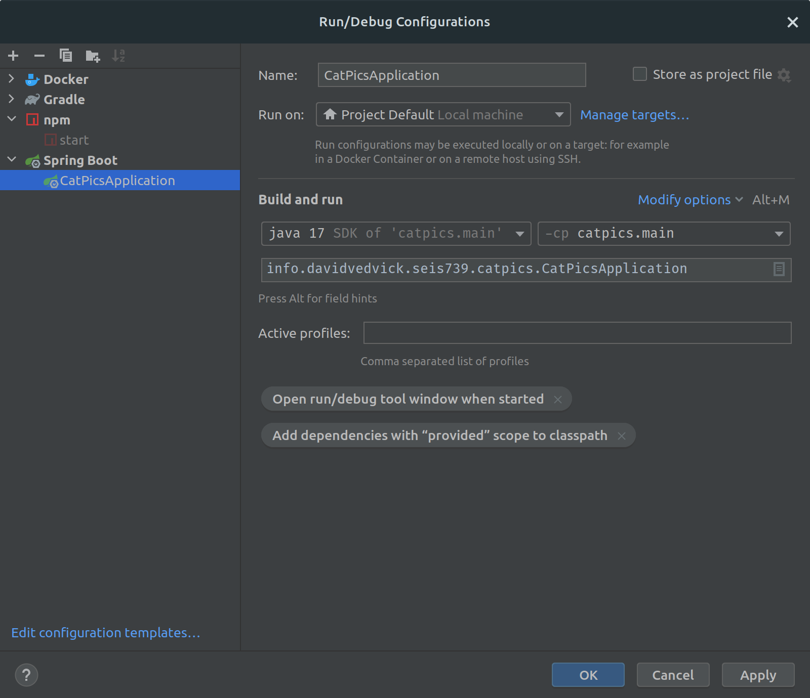

# catpics

catpics is public image gallery software devoted entirely to those animals we most love, cats! 

# Development

[](https://github.com/davidvedvick/picture-categorizer/actions/workflows/dockerbuild.yml)

## Getting Started

These instructions will get you a copy of the project up and running on your local machine for development
and testing purposes.

### Prerequisites

Docker and NodeJS 16+ is required to develop catpics.

### Installing

1. Clone this repository.
2. Install Eclipse or IntelliJ IDEA.
3. Build and run!

## Running a Development Environment

This application was developed with IntelliJ IDEA and will thus likely be easiest to run
for development with IntelliJ IDEA. To run a development environment locally, do the following:

1. Start MariaDB. If you run your MariaDB instance without Docker, then adjust `app-config.json` as necessary.
To run it **with** Docker, you can just run the following command:

```shell
docker compose up db
```

2. Start the Spring Boot server. If your IDEA supports Spring Boot (IntelliJ IDEA Ultimate has native support), this is
as easy as running it out of IDEA:



3. Start the NodeJS Server. This is as easy as opening a command prompt in the folder `frontend` and running this command:

```shell
npm start
```

## Running the tests

Run the tests via the IDE or in a command line with this command:

```shell
./gradlew test
```

## Running the Build

Your IDE can perform the build. To run a CI build like it is run in Github, run the following command:

```shell script
./gradlew test build
```

## Deployment

Deployment requires a version of Docker installed that supports [buildkit](https://docs.docker.com/build/buildkit/).

To deploy on a docker host run the following command:

```shell
docker compose build web && docker compose up
```

## Built With

- [Gradle](https://gradle.org/) - Dependency and Build Management
- [Kotlin](https://kotlinlang.org/) - Language project blue is migrating to
- [Java](https://www.java.com/en/) - Majority of the project is written in Java
- [IntelliJ IDEA](https://www.jetbrains.com/idea/) - IDE
- [ReactJS](https://reactjs.org) - Front-end framework
- [Bootstrap](https://getbootstrap.com) - Provides styling of front-end

## Contributing

All code is considered guilty until proven innocent! Please ensure that your code is proven with unit
tests before submitting a PR. No PR will be considered without the tests to back it up.

Please read [CONTRIBUTING.md](CONTRIBUTING.md) for more details on our code of conduct, and the
process for submitting pull requests to us.

## Authors

- David Vedvick

## License

This project is licensed under the MIT License - see the [LICENSE](LICENSE)
file for details.
